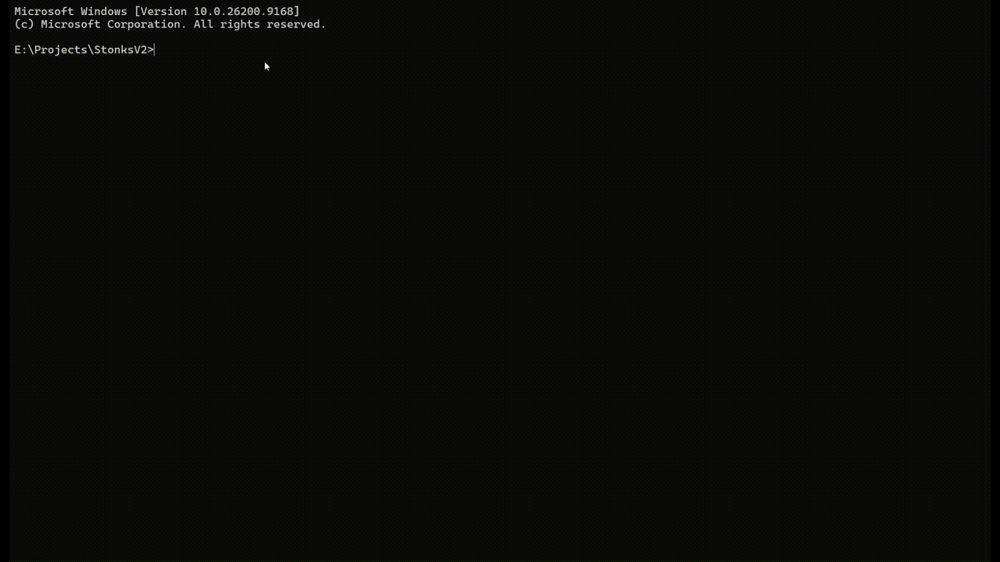
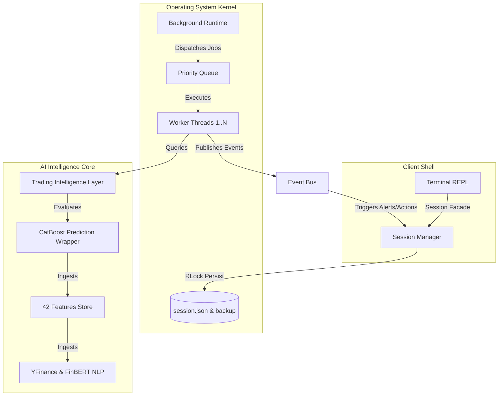

# 📈 STONKS: The AI Trading Operating System

[](https://www.python.org/)
[](https://github.com/kushisafk/stonks/releases)
[](LICENSE)
[](https://github.com/psf/black)
[](https://catboost.ai/)
[](https://huggingface.co/ProsusAI/finbert)
[](#)

> [!IMPORTANT]
> **STONKS is a persistent, multi-threaded event-driven AI operating system designed to run calibrated ML predictions, news NLP indexing, mock portfolios, and background analysis schedulers.**



---

## ⚡ Why STONKS?

Most financial engineering repositories are fragmented: they either **only predict** (offline notebooks), **only visualize** (simple web interfaces), or **only backtest** (isolated scripting environments). 

STONKS is engineered to bridge these gaps. It provides a unified **AI Trading Operating System** that decouples machine learning predictions from trade executions:

```
        Predictive Engine          Intelligence Layer           Operating Shell
     ┌─────────────────────┐     ┌─────────────────────┐     ┌─────────────────────┐
     │  Isotonic Calibrated│ ──> │   Decoupled Risk,   │ ──> │ Persistent Terminal │
     │  CatBoost/XGBoost   │     │  Reasoning & Plans  │     │   & Background OS   │
     └─────────────────────┘     └─────────────────────┘     └─────────────────────┘
```

By maintaining a persistent state kernel (the **Session Manager**) and coordinating tasks asynchronously via the **Background Event Runtime**, STONKS runs continuous analysis pipelines, tracks multi-asset stop-losses, and updates risk allocations in the background while you navigate the terminal.

---

## 🖥️ Quick Demo

Run the console script to start the interactive shell:
```bash
stonks
```

```
╔════════════════════════════════════╗
║            STONKS                  ║
║   AI Trading Operating System      ║
╚════════════════════════════════════╝

Workspace : Default
Model     : Catboost
Watchlists: 1 (Tech)
Positions : 0
Alerts    : 0

stonks> market analyze NVDA
[i] Collecting market candles and news feeds...
[i] Running features ingestion & CatBoost calibrated inference...

## STONKS prediction report for NVDA
Consensus Recommendation: BUY (78.2% calibrated probability)
Sentiment Index         : +0.45 (positive news bias)
Risk Level              : Moderate (Risk Score: 45)
Explanation             : Directional uptrend supported by abnormal volume breakouts.

stonks> position open long NVDA 50 122.40
[✓] Opened LONG position: 50 NVDA @ $122.40

stonks> portfolio summary
Portfolio Summary
+------------------+-----------------+
| Metric           | Value           |
+------------------+-----------------+
| Cash Balance     | $93,880.00      |
| Long Market Val  | $6,120.00       |
| Total Equity     | $100,000.00     |
| Realized P/L     | $0.00           |
| Unrealized P/L   | $0.00           |
+------------------+-----------------+

stonks> runtime start
[✓] Background event runtime scheduler and worker pool started.
[HEARTBEAT] Uptime: 0s | Jobs: 0 OK / 0 Fail | Memory: 85.20 MB | Queue: 0
```

---

## ✨ Core Capabilities

| Capability | Description |
| :--- | :--- |
| **📈 Market Intelligence** | Automated SPY index alignment, tz protection, and 42 engineered indicators (relative strength, volume breakouts). |
| **🧠 Decision Engine** | Decoupled prediction and execution. Multi-stage filters gating raw ML confidences through sentiment biases and risk rules. |
| **⚡ Background Runtime** | Thread-safe daemon scheduler and priority worker queue executing continuous watch sweeps. |
| **💼 Portfolio Management** | Real-time position bookkeeping, margin limits, target trackers, and atomic state recoveries. |
| **🖥️ Interactive Terminal** | Advanced REPL console shell featuring tab autocompletion and persistent command histories. |
| **📊 Research Tools** | Rolling walk-forward chronological benchmarking suites to evaluate and rank classifiers. |

---

## 🏛️ System Architecture

STONKS is built on clean, decoupled subsystems communicating via thread-safe managers and queues:



---

## 🚀 How STONKS Works: Step-by-Step

Here is what happens when a signal is processed and monitored:

```
  [1] USER REQUEST   ──>   [2] INGESTION       ──>   [3] FEATURES
  Type CLI command         Historical candles        Engineers 42 metrics
  or runtime triggers      and FinBERT news          (e.g., SPY offsets,
                           articles fetched.         volume SMAs).
                                   │
                                   ▼
  [6] PORTFOLIO      <──   [5] DECISION        <──   [4] MODEL
  Checks stop-losses,      Ensemble gates            CatBoost outputs
  allocates capital,       signal via sentiment      calibrated buy/sell
  and saves state.         and risk profiles.        probability.
           │
           ▼
  [7] RUNTIME MONITORS
  Worker pool continuously sweeps watchlists, adjusting positions and triggering alerts.
```

---

## 📁 Repository Structure

```
STONKS/
├── docs/                      # Extensive architecture papers & command manuals
│   ├── architecture/          # Chronological phase documents and layer designs
│   └── command_reference.md   # Complete CLI subcommand handbook
├── examples/                  # Standalone Python scripts demonstrating API integrations
├── stonks/                       # Central application packages
│   ├── agent/                 # TradingAgent pipeline coordinator
│   ├── intelligence/          # Risk, Reasoner, Explainer, and Recommendation engines
│   ├── runtime/               # Background scheduler, EventBus, and WorkerPool
│   ├── session/               # State kernel facade and atomic persistence
│   └── terminal/              # Interactive REPL CLI shell interface
├── tests/                     # Automated testing suite
├── pyproject.toml             # Package configuration & console entry points
└── requirements.txt           # Core runtime dependencies
```

---

## 🛠️ Installation & Setup

STONKS requires Python **3.11** or **3.12**.

1. **Clone the repository**:
   ```bash
   git clone https://github.com/kushisafk/stonks.git
   cd stonks
   ```
2. **Install the package in editable mode**:
   ```bash
   pip install -e .
   ```
3. **Launch the terminal**:
   ```bash
   stonks
   ```

---

## 💡 Quick Start Tutorial

Once the shell starts, run this workflow to perform research and manage positions:

### Step 1: Create a Watchlist and Track Tickers
```
stonks> watchlist create Growth
stonks> watchlist add Growth AAPL "Consolidating near support" 3 175.00
```

### Step 2: Run Predictions & Explainers
```
stonks> market analyze AAPL
stonks> market explain AAPL
```

### Step 3: Open and Monitor Positions
```
stonks> position open long AAPL 100 170.00
stonks> position update-stop AAPL 165.00
stonks> position list
```

### Step 4: Run the Background Monitor
```
stonks> runtime start
stonks> runtime status
```

---

## ⌨️ CLI Subcommand Quick Reference

| Namespace | Subcommand Example | Description |
| :--- | :--- | :--- |
| **`market`** | `market analyze <TICKER>` | Runs predictions, sentiments, and outputs a detailed Markdown report. |
| **`position`**| `position open long <T> <Q> <P>`| Opens a LONG position, calculating stop limits. |
| **`portfolio`**| `portfolio summary` | Renders cash, buying power, equity, and unrealized P/L panels. |
| **`watchlist`**| `watchlist add <NAME> <T>` | Tracks a symbol under a named watchlist folder. |
| **`runtime`** | `runtime start` | Spawns background scheduler and worker daemon threads. |
| **`research`** | `research benchmark` | Renders walk-forward performance tables of ML wrappers. |
| **`session`** | `session save` | Triggers a thread-safe atomic serialization write to disk. |
| **`profile`** | `profile risk <Tier>` | Updates default capital allocations and style (Conservative/Aggressive). |
| **`alerts`**  | `alerts list` | Lists stop-loss violations and price limit breaches. |

*Review [command_reference.md](docs/command_reference.md) for full parameter scopes.*

---

## 🛠️ Technology Stack

| Layer | Technology |
| :--- | :--- |
| **Core Language** | Python 3.11 / 3.12 |
| **Machine Learning** | CatBoost, XGBoost, LightGBM, Scikit-Learn, Joblib |
| **Natural Language Processing**| Transformers, Hugging Face Hub (ProsusAI FinBERT) |
| **Data & Indicators** | Pandas, Numpy, YFinance |
| **Persistent Facade** | Pydantic v2 (Validation), Pydantic Settings |
| **Background Runtime** | Multi-threaded Worker Pool, Priority Queue, Condition variables |
| **CLI & Interface** | Shlex (Tokenization), Persisted shell histories, Tab completion |
| **Testing** | Pytest, Pytest-cov |

---

## 📚 Core Documentation Links
* [Architecture Overview](docs/architecture/architecture_overview.md)
* [Terminal CLI Guide](docs/architecture/terminal_guide.md)
* [Prediction Pipeline Details](docs/architecture/prediction_pipeline.md)
* [Runtime Orchestration](docs/architecture/runtime_pipeline.md)
* [Session Management Details](docs/architecture/session_manager.md)
* [CLI Command Reference](docs/command_reference.md)

---

## 🔮 Roadmap

### v1.1: Multi-Market
* US & Indian stocks, Indian ETFs, Asset Registry.
* Custom asset additions + per-asset CatBoost model training.

### v1.2: Better Models
* LSTM, GRU, and 1D Temporal Convolutional Networks (TCN) models.
* Benchmarking sequence deep models against tree models.

### v1.3: Advanced Intelligence
* Time-Series Transformers (Informer, PatchTST).
* Tabular-sequence stacked hybrid ensembles and advanced market context features.

### v1.4: Trading Simulation
* Paper trading sandbox, portfolio performance metrics tracking, and advanced volatility sizing.

### Later
* Live broker integration, Telegram/Discord notifications, and React web dashboards.

---

## 🤝 Contributing
Contributions are welcome! Please review [CONTRIBUTING.md](CONTRIBUTING.md) for code formatting, linting, tests execution, and branch conventions.

---

## ⚖️ License & Disclaimer

**License**: Distributed under the [MIT License](LICENSE).

**Disclaimer**: STONKS is a research and educational decision-support simulator. It is **not** professional financial advice, and does **not** contain automated live transaction execution logic. Read [SECURITY.md](SECURITY.md) for terms.
