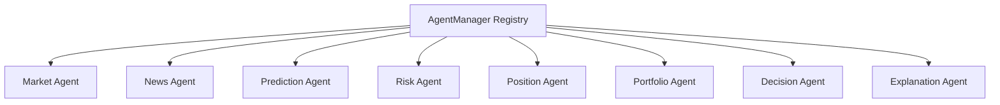

# STONKS Agent Overview

This document describes the design, interfaces, and registration patterns for trading agents inside STONKS.

---

## 1. Agent Architecture

STONKS defines specialized agents, coordinated dynamically by the `AgentManager` and scheduled via the background `StonksRuntime`:



---

## 2. Core Agent Definitions

### A. Market Agent
* **Responsibilities**: Retrieves and validates price feeds for symbols on watchlists.
* **Events Published**: `PriceUpdateEvent`

### B. News Agent
* **Responsibilities**: Sweeps yfinance news tickers, tokenizes article headlines, and indexes sentiments.
* **Events Published**: `NewsUpdateEvent`

### C. Prediction Agent
* **Responsibilities**: Computes engineered indicators and queries the Calibrated CatBoost model.
* **Events Published**: `PriceUpdateEvent` (with prediction confidence bounds)

### D. Risk Agent
* **Responsibilities**: Audits stops and profit targets against current price feeds.
* **Events Published**: `AlertTriggeredEvent`

### E. Position Agent
* **Responsibilities**: Synchronizes state mutations (e.g. open long, open short, partial covers) with the Session Manager.
* **Events Published**: `PositionOpenedEvent`, `PositionClosedEvent`

### F. Portfolio Agent
* **Responsibilities**: Recalculates LMV, SMV, Total Equity, Net Exposures, and Sector Allocation.
* **Events Published**: `PortfolioChangedEvent`

### G. Decision Agent
* **Responsibilities**: Performs weighted ensemble decision voting and routes transactions.
* **Events Published**: `RecommendationChangedEvent`

### H. Explanation Agent
* **Responsibilities**: Resolves technical statistics into a natural language explainer.

---

## 3. Registering Plugins & Future Agents
Future agents register dynamically without editing the main runtime:
```python
# Instantiate custom agent
my_arbitrage_agent = ArbitrageAgent()

# Register to the runtime agent registry
runtime.agent_manager.register_agent("arbitrage_agent", my_arbitrage_agent)
```
This keeps the core operating system kernel extensible.
