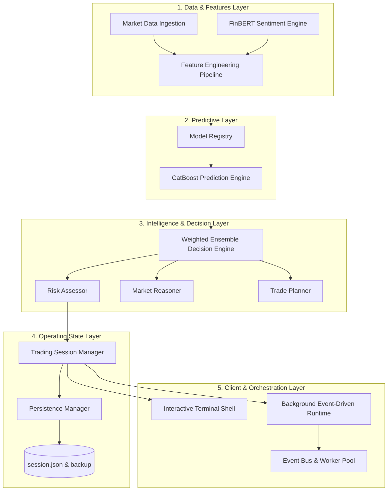

# STONKS Architecture Overview

This document presents the high-level system architecture of **STONKS – AI Trading Operating System**, version 1.0.

---

## 1. High-Level System Architecture

STONKS is organized into decoupled layers: Ingestion, Features, Models, Intelligence, Session Management, and Runtime. Every layer communicates either synchronously via unified managers or asynchronously through the event bus.

---

## 2. Layer Definitions

### A. Data & Features Ingestion
* **Market Data Service**: Handles historical price-action ingestion using protection against look-ahead bias and reindexing time alignment.
* **FinBERT Sentiment Engine**: Processes recent news articles and outputs a continuous sentiment index score.

### B. Machine Learning & Model Registry
* **Model Registry**: Central registry of wrappers (`CatBoost`, `XGBoost`, `Random Forest`, etc.).
* **Calibrated Inference**: CatBoost runs predictions using calibrated classifiers, converting feature matrices into accurate buy/sell probability indicators.

### C. Trading Intelligence Layer
* **Ensemble Decision Engine**: Evaluates prediction signals and applies universal threshold filters (`70% / 40%`).
* **Risk Assessor**: Checks stops, position limits, and alerts rules.
* **Explanation Engine**: Translates complex ML outputs into readable English explanations.

### D. Trading Session Manager
* Unified persistent facade tracking positions, watchlists, default configurations, and transaction records.

### E. Background Runtime
* Spawns multi-threaded worker pools and cron-style schedulers. Dispatches price changes, recommendation revisions, and triggers autosaves.
