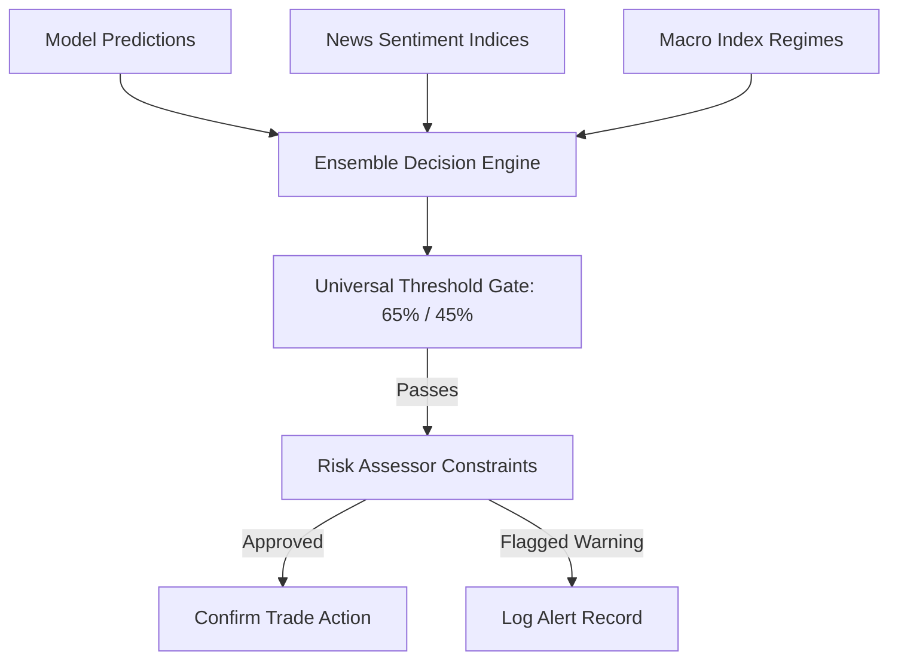

# STONKS Decision Engine

This document outlines the architecture and execution logic of the STONKS Ensemble Decision Engine.

---

## 1. Decision Flow

The Decision Engine sits between predictive models and trading actions. It combines predictions, sentiment scores, and market filters, executing checks before routing decisions:

---

## 2. Weighted Ensemble Mechanics

The Ensemble Decision Engine executes a multi-stage consensus sweep:
1. **Model Probability Ingestion**: Extracts calibrated directional probabilities from the active CatBoost model.
2. **Sentiment Scaling**: Dynamically adjusts the prediction vector based on the news sentiment index. High sentiment values increase buy signal weights, while negative sentiment increases sell signal weights.
3. **Threshold Gates**:
   - **Buy threshold ($65\%$)**: Signals are ignored unless the calibrated buy probability exceeds $65\%$.
   - **Sell threshold ($45\%$)**: Signals trigger sells or short sells if the probability falls below $45\%$.
4. **Risk Audits**: Checks leverage parameters, asset allocation bounds, stop-losses, and profit targets.
