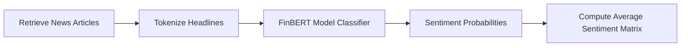

# STONKS Phase 2: Sentiment Intelligence (FinBERT)

This document details the construction of the FinBERT Sentiment Intelligence pipeline.

---

## 1. Sentiment Processing Pipeline

Phase 2 introduced the processing pipeline to ingest recent news articles, execute FinBERT classification, and output sentiment scores:

---

## 2. FinBERT Integration Details

* **Hugging Face Hub**: Dynamically loads the `ProsusAI/finbert` classifier weights.
* **Sentiment Scores (8 columns)**:
  - `sentiment_score`: Continuous value between `-1.0` (Highly Bearish) and `+1.0` (Highly Bullish).
  - `positive_ratio`, `negative_ratio`, `neutral_ratio`: Classification softmax probabilities.
  - `article_count`: Total parsed articles per ticker.
  - `weighted_sentiment`: Weighted scores by publisher reach or article quality.
* **Look-Ahead Bias Protection**: Live news is appended chronologically. Historical backtests fill sentiment features with neutral `0.0` values to prevent leaking future news events into model training.
