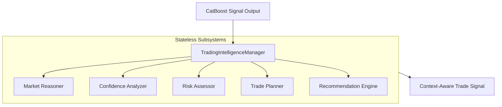

# STONKS Phase 5: Trading Intelligence Layer

This document details the architecture of the Trading Intelligence Layer introduced in Phase 5.

---

## 1. Intelligence Subsystems

Phase 5 transformed STONKS from a raw probability predictor into a context-aware trading assistant:

---

## 2. Subsystem Definitions

### A. Market Reasoner
* **Responsibilities**: Evaluates market indexes (SPY), relative strength parameters, and volume patterns to justify signals.

### B. Confidence Analyzer
* **Responsibilities**: Maps calibrated probabilities to discrete tiers (High, Medium, Low).

### C. Risk Assessor
* **Responsibilities**: Checks stops, position sizing limits, and flags high-volatility warnings.

### D. Trade Planner
* **Responsibilities**: Recommends stop loss levels, target profit points, and capital allocations based on volatility.

### E. Recommendation Engine
* **Responsibilities**: Computes the final consensus signal and outputs a structured natural-language reasoning explanation.
