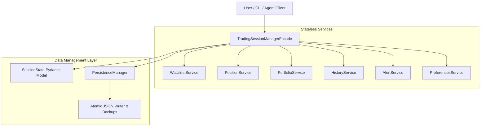
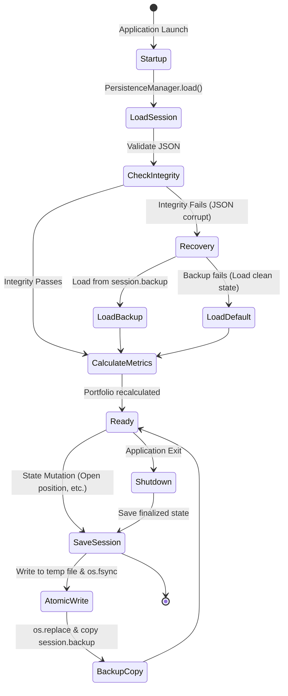

# STONKS Phase 6 Architecture Specification: Trading Session Manager

This document provides a detailed overview of the architectural design, data models, lifecycle state machines, and persistence mechanisms introduced in STONKS Phase 6.

---

## 1. High-Level Architecture Overview

The **Trading Session Manager** acts as the central Operating System layer for the STONKS trading platform. Every service or agent is stateless; any persistent state is held in a unified `SessionState` block and managed by the `TradingSessionManager` facade.

### System Diagram



---

## 2. Core Service Relationships & Data Flows

All service layers interact exclusively by mutating the shared in-memory `SessionState` passed down by the Manager, triggering automatic updates across dependency chains:

```
[Position Service Mutation]
          ↓ (e.g. open_long_position)
[Portfolio Service Metrics Calculation]
          ↓ (LMV, SMV, Total Equity recalculation)
[Persistence Manager Atomic Write]
          ↓ (fsync + rename swap)
[User Session Saved]
```

### Automatic Portfolio Calculations
Whenever a position changes state (Open Long, Open Short, Close, Partial Close):
1. **Long Market Value (LMV)** is calculated as:
   $$\text{LMV} = \sum_{\text{long positions}} (\text{Quantity} \times \text{Current Price})$$
2. **Short Market Value (SMV)** is calculated as:
   $$\text{SMV} = \sum_{\text{short positions}} (\text{Quantity} \times \text{Current Price})$$
3. **Open Equity** is calculated as:
   $$\text{Open Equity} = \text{LMV} - \text{SMV}$$
4. **Total Equity** & **Portfolio Value** are calculated as:
   $$\text{Total Equity} = \text{Cash Balance} + \text{Open Equity}$$
5. **Net Exposure** is calculated as:
   $$\text{Net Exposure} = \text{LMV} - \text{SMV}$$
6. **Buying Power** is calculated as standard liquid cash remaining:
   $$\text{Buying Power} = \text{Cash Balance}$$

---

## 3. Data Models (Session Schema)

All schemas are declared using Pydantic for validation and serialization.

### SessionState
* `schema_version`: `int` (Defaults to `1`)
* `user_profile`: `UserProfile`
* `preferences`: `Preferences`
* `watchlists`: `Dict[str, Watchlist]` (Key: watchlist name)
* `positions`: `Dict[str, Position]` (Key: ticker)
* `portfolio`: `Portfolio`
* `history`: `List[DecisionRecord]`
* `alerts`: `List[Alert]`

---

## 4. Session Lifecycle



---

## 5. Persistence & Recovery Mechanisms

To protect active sessions against crashes, corrupted writes, or power failures:
1. **Atomic Write Pipeline**:
   - Write serialized `SessionState` JSON to a temporary file in the target directory (e.g., `session.json.tmp`).
   - Call `os.fsync` on the temporary file descriptor to force the OS cache to physical disk.
   - Perform `os.replace` to replace `session.json` atomically. This operation is guaranteed atomic at the OS level on Windows and Unix systems.
2. **Double-fault Protection (Backups)**:
   - On every successful write, copy the file to `session.backup`.
   - If loading `session.json` fails due to formatting issues or corruption, the manager automatically rolls back to `session.backup`, logs a warning, and copies the backup back to `session.json`.
   - If both files are corrupted, it initializes a clean default state to keep the platform responsive.

---

## 6. Future Extension Points

The Trading Session Manager is designed as a pluggable boundary layer:
* **Database Migration**: The `PersistenceManager` can be replaced with an SQL persistence manager (e.g., using SQLAlchemy or direct PostgreSQL drivers) by changing the serialization logic in `PersistenceManager.load` and `PersistenceManager.save`. Higher layers (cli, backend API, execution agents) do not have direct DB access, meaning database upgrades will not require modifications to the rest of the codebase.
* **Broker Syncing**: A future Broker Syncing Agent can hook into `update_portfolio_metrics` to retrieve live account equity and buying power from broker APIs (e.g. Alpaca, Interactive Brokers) instead of relying on local estimations.
* **Notification Dispatchers**: The `AlertService` can be extended with a background listener class to automatically route recorded alerts to preferred communication channels (Slack, Discord, Email) based on `user_profile` preferences.
