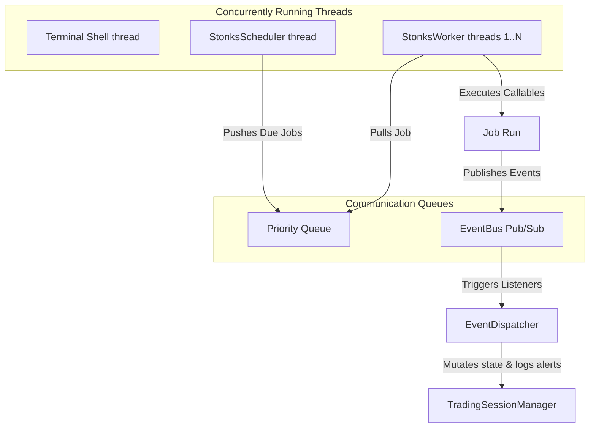

# STONKS Phase 8 Architecture Specification: Event-Driven Runtime

This document provides a detailed overview of the architectural design, thread model, scheduling algorithms, and event flows implemented in STONKS Phase 8.

---

## 1. Runtime Architecture & Thread Model

The **STONKS Runtime** is an event-driven orchestrator designed to perform background market analysis, metrics aggregation, alert monitoring, and task queueing. Rather than spinning in hot loops, it runs asynchronously across several coordinated threads:



### Thread Allocation:
1. **Terminal Shell thread**: Executes the interactive terminal REPL, waiting for user keyboard input.
2. **StonksScheduler thread**: Monitors recurring tasks (sweeps, backups, heartbeats), calculate delays, and puts jobs in the Priority Queue.
3. **StonksWorker threads (1..4)**: Sleep until jobs appear in the priority queue. Pulls jobs based on priority levels, executes them, and automatically retry on failures.

---

## 2. Event Flows & Pub/Sub Event Types

Subsystems communicate exclusively through the thread-safe `EventBus`. The 13 default event types are:

* **Startup & Shutdown**: `RuntimeStartedEvent`, `RuntimeStoppedEvent`
* **Session Lifecycle**: `SessionLoadedEvent`, `SessionSavedEvent`
* **Pipeline Beats**: `TimerEvent`
* **Market Context**: `PriceUpdateEvent`, `NewsUpdateEvent`
* **Decisions**: `RecommendationChangedEvent`, `AlertTriggeredEvent`
* **Positions**: `PositionOpenedEvent`, `PositionClosedEvent`
* **Portfolios**: `WatchlistUpdatedEvent`, `PortfolioChangedEvent`

---

## 3. Scheduler & Worker Priority Concurrency

* **Priority Queue**: Python's thread-safe `queue.PriorityQueue` manages task precedence. High-priority tasks (e.g. watchlist sweeps, priority = 3) execute before low-priority tasks (e.g. heartbeat logs, priority = 10).
* **Sentinel Termination**: Thread pools shut down cleanly by submitting a high-priority `SentinelJob` with a unique `SHUTDOWN_SENTINEL` job ID. This guarantees no comparison failures.
* **Fault Isolation**: Unhandled exceptions inside any worker callable are caught, logged, and registered under the failed metric registry. A single failing job never halts the worker pool or the parent runtime.
* **Lock Synchronization**: Reentrant locks (`RLock`) coordinate the `PersistenceManager` reads and writes, resolving Windows access conflicts (e.g. `WinError 5`) during parallel updates.

---

## 4. Heartbeat and Runtime Health Metrics

The periodic heartbeat monitoring logs performance payloads:
* **Uptime**: Total seconds running.
* **Memory RSS**: Current resident memory allocation (utilizes `psutil` or falls back gracefully).
* **Jobs executed & failed**: Numerical counters.
* **Average analysis latency**: Rolling speed metrics.

---

## 5. Extension Guide: Registering Custom Agents & Tasks

To extend the runtime:
1. **Create the Agent**: Define a custom class containing execution logic:
   ```python
   class TradingSignalAgent:
       def process_signal(self, data):
           # Process logic
   ```
2. **Register it in the Agent Manager**:
   ```python
   runtime.agent_manager.register_agent("signal_agent", TradingSignalAgent())
   ```
3. **Register Background Tasks**: Add named job configurations to `TaskRegistry`:
   ```python
   runtime.task_registry.register("custom_signal_sweep", my_callback_fn, default_interval=600)
   ```
