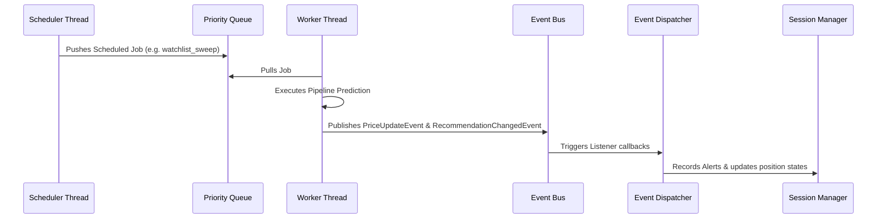

# STONKS Runtime Pipeline

This document describes the thread model, execution queues, and event flows of the background Operating System runtime.

---

## 1. Event Ingestion & Dispatch Flow

The STONKS Runtime uses a multi-threaded, event-driven pattern. Scheduled checks queue prioritized jobs executed by concurrent worker threads:

---

## 2. Dynamic Thread Allocations & Queues

* **Scheduler Thread**: Computes the exact time until the next scheduled job is due. Sleeps on a condition variable (`threading.Condition`) to avoid busy-waiting.
* **Worker Threads**: Wake up when jobs are pushed to the priority queue. Standard execution handles unhandled exceptions gracefully to guarantee fault isolation.
* **Autosave Lock**: Concurrently running jobs calling the session manager file writes are synchronized via reentrant locks (`RLock`) to resolve resource-access blocks.
