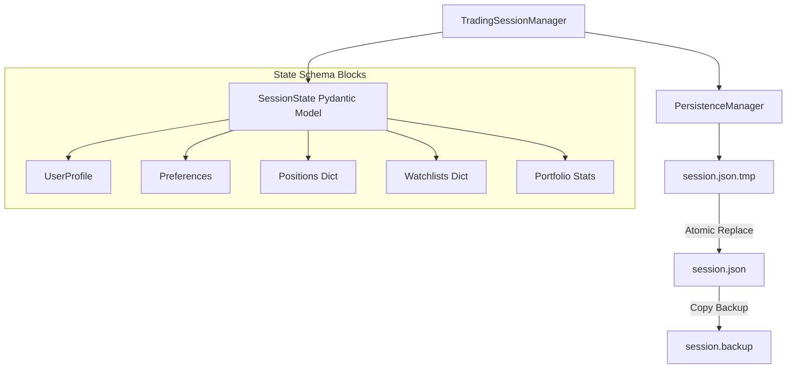

# STONKS Session Manager

This document describes the state models and persistence architecture of the STONKS Trading Session Manager.

---

## 1. Session Architecture & State Model

The `TradingSessionManager` acts as the unified Operating System layer. All services (watchlist, position, portfolio, alert, history) manipulate a shared, in-memory `SessionState` block:

---

## 2. Dynamic Portfolio Calculations

Position mutations automatically recalculate the portfolio:
* **Long Market Value (LMV)**: Sum of all open long share holdings.
* **Short Market Value (SMV)**: Sum of short liabilities.
* **Total Equity & Portfolio Value**: $\text{Cash Balance} + \text{LMV} - \text{SMV}$
* **Net Exposure**: $\text{LMV} - \text{SMV}$
* **Buying Power**: Standard cash remaining.

---

## 3. Atomic Serialization & Backups

To protect against system crashes or file corruptions during updates:
1. **Temp Write & Sync**: Serialization writes JSON to a temporary file, calling `os.fsync` to flush the OS cache.
2. **Atomic Swap**: Calls `os.replace` to replace the active `session.json` atomically.
3. **Backup Copy**: Copies the file to `session.backup`.
4. **Recovery Rollback**: If `session.json` is missing or corrupted, the persistence layer rolls back to `.backup` automatically. If both are corrupted, it initializes a clean default state.
5. **Thread Safety**: Wrap operations in a reentrant lock (`RLock`) to resolve concurrent writes.
