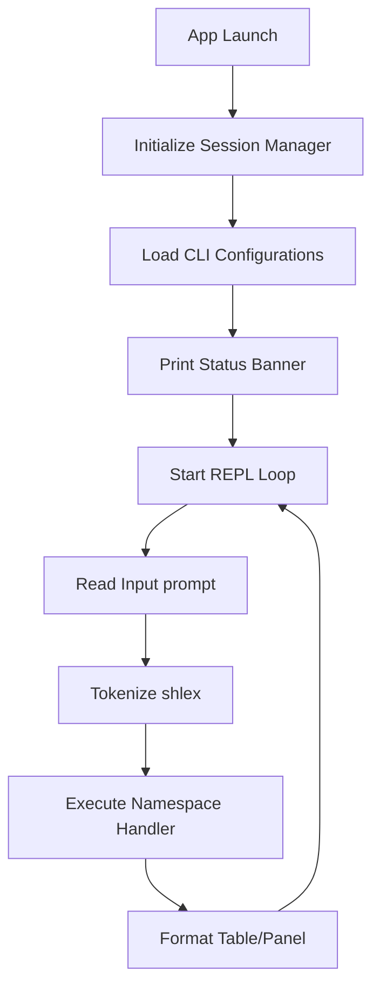

# STONKS Terminal Guide

This document describes how to launch, operate, and extend the STONKS Interactive Terminal.

---

## 1. Terminal Startup & Flow

Launching the terminal (`python -m stonks.terminal.app` or running the `stonks` startup script) initializes the `TradingSessionManager`, loads configs, and prints the startup status panel before starting the REPL loop:

---

## 2. Token Parsing & Aliases

* **Quoted Arguments**: Arguments containing spaces can be wrapped in quotes:
  `watchlist add Growth AAPL "Tech Giant Long Term Hold"`
* **Namespace Aliases**: Shortcuts speed up CLI navigation:
  - `p` -> `position` (e.g., `p list` -> `position list`)
  - `w` -> `watchlist`
  - `port` -> `portfolio`
  - `m` -> `market`
  - `r` -> `research`
  - `s` -> `session`
  - `a` -> `alerts`
  - `q` / `exit` -> stops runtime and exits shell loop.

---

## 3. Autocomplete & History

* **Autocomplete**: Tab-completion suggestions complete subcommands (e.g. `position open long`) and ticker symbols fetched from watchlist and positions state.
* **Persistent History**: Shell entries are saved to `.stonks_history` at the root folder, loading previous command runs on startup.
