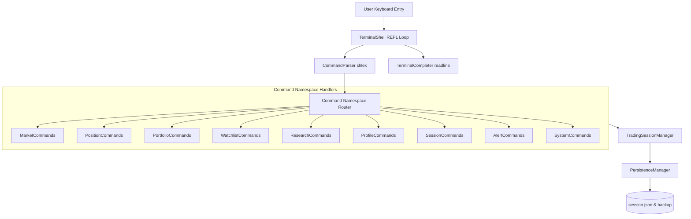

# STONKS Phase 7 Architecture Specification & User Guide: Interactive Terminal

This document provides a detailed overview of the design, command structure, error flows, and usage guidelines for the **STONKS Interactive Terminal**.

---

## 1. System Architecture Overview

The Interactive Terminal serves as the user-facing operating system shell interface. It executes a Read-Eval-Print Loop (REPL) that consumes structured commands, interacts with the unified `TradingSessionManager` facade, and displays formatted outputs.



---

## 2. Command Tree Reference

Commands are strictly partitioned by namespaces to maintain organization:

```
stonks/
├── market
│   ├── analyze TICKER
│   ├── compare TICKER1 TICKER2
│   ├── research TICKER
│   ├── news TICKER
│   ├── inspect TICKER
│   ├── explain TICKER
│   └── chart TICKER (placeholder)
├── position
│   ├── list
│   ├── open long TICKER [qty] [price]
│   ├── open short TICKER [qty] [price]
│   ├── close TICKER [exit_price]
│   ├── reduce TICKER PERCENT [exit_price]
│   ├── increase TICKER [qty] [price]
│   ├── review TICKER
│   ├── update-stop TICKER PRICE
│   └── update-target TICKER PRICE
├── portfolio
│   ├── summary
│   ├── exposure
│   ├── performance
│   ├── sectors
│   ├── risk
│   └── history
├── watchlist
│   ├── list
│   ├── create NAME
│   ├── delete NAME
│   ├── add NAME TICKER [notes] [priority] [target_price]
│   ├── remove NAME TICKER
│   └── rename OLD_NAME NEW_NAME
├── research
│   ├── benchmark
│   ├── thresholds
│   ├── features
│   ├── models
│   ├── importance
│   └── history
├── session
│   ├── status
│   ├── save
│   ├── reload
│   └── reset
├── profile
│   ├── show
│   ├── edit FIELD VALUE
│   ├── risk RISK_LEVEL
│   ├── capital AMOUNT
│   └── preferences [FIELD VALUE]
├── alerts
│   ├── list
│   ├── clear
│   └── acknowledge
└── help / version / clear / exit / quit
```

---

## 3. Autocomplete & History Configuration

* **Command Autocomplete**: Pressing `Tab` dynamically completes namespace names and subcommand verbs.
* **Ticker Autocomplete**: Symbol arguments are automatically suggested based on active watchlist items and open positions in the current session.
* **Persistent History**: Command histories are serialized to `.stonks_history` at the root workspace folder, permitting command retrieval via the `Up` and `Down` arrow keys.

---

## 4. Mock Terminal Session Examples

### Startup Banner

```
╔════════════════════════════════════╗
║            STONKS                 ║
║ AI Trading Operating System       ║
╚════════════════════════════════════╝

Workspace : Default
Model     : Catboost
Watchlists: 2
Positions : 1
Alerts    : 0

Type "help" to begin.

stonks>
```

### Tabular ASCII Output (e.g. `portfolio summary`)

```
╔══ Portfolio Summary =══════════════════════════════════╗
║ Cash Balance    : $85,000.00                           ║
║ Buying Power    : $85,000.00                           ║
║ Open Equity     : $16,000.00                           ║
║ Total Equity    : $101,000.00                          ║
║ Portfolio Value : $101,000.00                          ║
║ Unrealized P/L  : +$1,000.00                           ║
║ Realized P/L    : $0.00                                ║
║ Largest Position: AAPL                                 ║
╚════════════════════════════════════════════════════════╝
```

---

## 5. Extension Guide: Adding New Commands

To register a new command or subcommand:
1. **Identify the Namespace**: Find the appropriate file inside `src/terminal/commands/` (e.g., `market.py`).
2. **Implement Command Logic**: Add a branch inside the namespace handler method:
   ```python
   elif subcmd == "my_new_action":
       # Implement logic
   ```
3. **Register Autocomplete**: Update `self.tree` in `src/terminal/completion.py` to support completion suggestions for the new subcommand:
   ```python
   "market": ["analyze", ..., "my_new_action"]
   ```
4. **Update Help File**: Append description notes to `src/terminal/commands/system.py` help dictionary.
